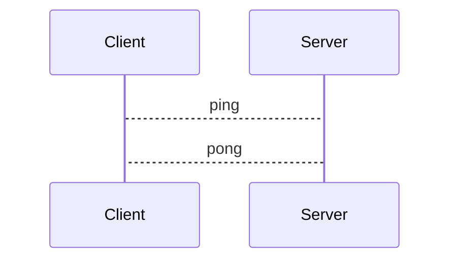

Temporary alternative for https://www.npmjs.com/package/astro-diagram (which needs fixes merged)

Enables using [MermaidJS](https://github.com/mermaid-js/mermaid) diagrams inline in .md(x) files in Astro.
Utilizing [Playwright](https://playwright.dev/) during build time, the HTML for diagrams is generated, and the snippets replaced.

# Installation
`npm install astro-mermaidjs`

`yarn install astro-mermaidjs`

`pnpm install astro-mermaidjs`

# Usage
In your `astro.config.{ts,mjs}`:
```javascript
import remarkMermaid from 'astro-mermaidjs/remark-mermaid';
// ...

export default defineConfig({
  // ...
  markdown: {
    remarkPlugins: [
      // ...
      remarkMermaid,
    ],
  },
  // ...
});
```

Then in .md(x) files, use the regular `mermaid` DSL like you would on Github or other mermaid-supporting markdown flavors:
````markdown

````
